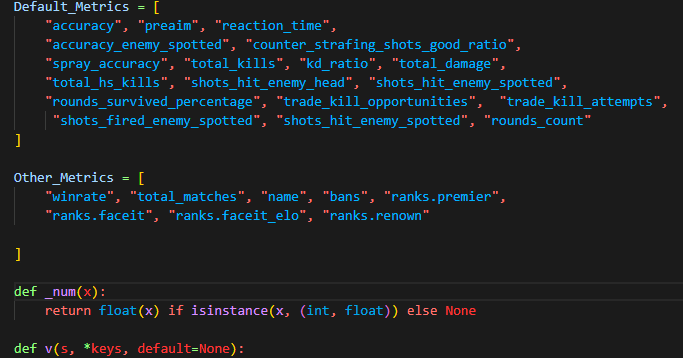
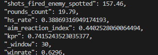
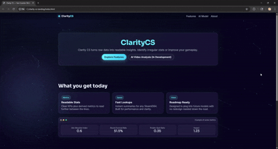

***June 25th, 2025***

**Changes & Updates**

*Phase 1: Frame-Based Categorization*
When initally undertaking this project, it originally started with a 2-dimensional CNN to classify screenshots from .mp4 files of demo footage.
The reasoning behind this was for my own understanding of image processing. Up until this point I only dealt with structured tabular data.
2-dimensional CNNs have their place in image classification, but in regards to identifying cheaters in Counter Strike it lacks temporal context.
Static images lack robustness.

*Phase 2: The Switch*
The next step was moving to video classification rather than static photos. This meant moving to "r3d_18" which is the 3D CNN equivalent of ResNet-18.
The standard input shape is [batch, channels, time, height, width].
Batch: Rather than trying to process hundreds or thousands of .mp4 files at once, it is divided into subsets called "batches."
Channels: This refers to the color channel which is RGB(3).
Time: This is the crucial difference maker, allowing the model to have temporal context. In this case it was 64 (frames not seconds).
Height & Width: Simply the pixel dimensions.

This allows for the model to now learn from behavior, not just visuals. Since the goal is to identify cheating behavior, this is important.

*Phase 3: The ".dem" Arc*
During this phase I took a slight tangent to explore the validity of incorporating .dem file parsing into the model. ".dem" files (short for demo)
are Valve's custom file types that allow a player to rewatch a match. It records structured game data such as tick rates, player position, crosshair angle, TTK(time to kill) thus allowing the user to watch from the perspective of any player in the lobby.
This was with the intent of extracting game data from legit players and cheaters to train a classification model (such as XGBoost) and then cross reference that with the video footage.

Major Issues: 
1. Unreliable sources to actually download the .dem files rather than auto-opening in the game (besides my own matches).
2. Syncing .dem tickrates to portions of .mp4 files. 

Therefore (atleast for now) utilizing .dem files to train a binary classification has been put on the back burner.

*Phase 4: First Successful Flag*
After returning to r3d_18, I created a prediction pipeline where the training model was loaded into a new enviroment, and fed a .mp4 clip from a demo.
Surprisingly it worked great with ClearVision identifying the player as a cheater with a confidence of 58%. The player used in the experiment is a known cheater in the top 200 on Premier.
Thise is a major milestone as it is the first instance of passing a .mp4 file, having every nth frame extracted and allowing the model to temporally analyze each frame sequentially to come to a conclusion.

*Next Phase*
As of now, the next step is to continue gathering demo footage in a class balanced manner. Once I reach ~1,000 snippets of demo footage I will move to training on a server-side GPU in HD quality.

***September 26, 2025***

*Phase 1 ~July 2025*
Implemented a stats module leveraging the newly released Leetify API. The base API provides match-level and account-level metrics such as aim rating, utility, HS%, counter-strafe success, ADR etc. along with identifiers like VAC bans, age of registration and elo. With these base statistics, further metrics were derived such as an "aim-reaction" index and "headshot-spot" index. These are just two examples of many where more in-depth statistics can reveal gameplay patterns. Ex: indexing on average how quickly it takes a player to fire a shot at the enemy's head and how frequently those are headshots. Consistently above average markers for their elo, or other high elo players could potentially raise red flags. Below are 2 images showing a few of the metric keys and raw stat output. (Keep in mind these are only about 25% of the stats that are truly derived; these have been truncated for readability):

Deriving this data for two resons:
1. Allow for surface level observation of a player's performance by a rolling windowed average (Example: I want to see this user's average spot-reaction time for the past 40 matches).
2. Leverage these points of data as features for machine learning to classify the chance of a player potentially cheating. This will use XGBoost.

XGBoost has been a superior method for predictive modeling due to the fact it's a self correcting algorithm. Unlike Random Forests or Extra Trees, XGBoost sequentially builds each tree. In simplest terms, this is how it works:

You are trying to predict a hidden number.
i. You make an initial guess that is incorrect
ii. Instead of guessing again you ask whether it is too low or too high
iii. Now you guess again, but with the intention of getting closer based on the feedback from step 2.
iv. Repeat steps 1-3 tens, hundreds, thousands or millions of times.

Each iteration is based off of previous attempts with it eventually converging on the correct value. In implementation, if the model is well balanced, it could reliably see new player data and infer their status. If you are interested in reading more about the theory behind XGBoost and why it is so powerful, I suggest this study from 2019 --> [**XGBoost**](https://arxiv.org/pdf/1911.01914).

*Phase 2 ~August 2025*
I began my journey in building a website with the goal being a onestop shop for an individual to look up player statistics via SteamID64 and a place to eventually host the computer vision model. I've never built a website before, so I'm self-pacing myself through web development courses online since it is something I've always wanted to learn. Therefore, "build as I go" is the methodology at the moment. However, there I have constructed a skeleton for the landing page as seen below. This will certainly not be the final product but definitely a start:

Update regarding CV Model: As usual, the last hurdle with the computer vision portion of ClarityCS is the data collection. Training should not be a major obstacle since the pipeline has been built. I will keep people posted on any major updates that happen regarding that.

***Feb 8, 2026***
So alot has changed since the last update. After trial and error with different methods I've settled on a promising one that has presented so promising signs. I previously disregarded demo parsers due to the initial method of computer vision that I was going for. However, I went back and came across AWPY, a demo parsing tool created by pnxenopoulos. It can be found here [AWPY](https://github.com/pnxenopoulos/awpy). This parsing tool extracts subtick level events from demo files such as weapon fired, XYZ of players, damage and health just to scratch the surface. What makes this tool extremely powerful is the .tri file configuration for mesh/collision data for every map in CS2. What this is traditionally used for is programs to see matches from a skybox view or extract map data with services such as Leetify. I was able to leverage this same tool to be able to create functions that can determine whether a player was visible on the screen during a kill. I have functions that create a vector from the shooter's eye level. If that vector intersects with the collision data, the enemy is behind cover. If that vector intersects with the surface area of the enemy, that means they are visible. This logic will be useful down the road with modeling ESP cheats.

As of right now I have analyzed 2 types of players: pros and "normal". 100 HLTV/FaceIt demos from pro players were extracted and parsed using AWPY. ~15,000 kills were tabulated alongside 100 Faceit demos of "normal players" ranging anywhere from Faceit lvl 2 to lvl 8. ~15,000 kills were tabulated from that as well. Subtick level windows were created around each kill event from all of these matches with calculations of their "aim error". The manner in how this was calculated wasn't important, so I'll show some of the insights drawn.

Essentially, this data isn't telling us anything truly ground breaking. Shocker, pros are more accurate than normal players. That wasn't the entire point however. This helped weed out useful (and even useless) features to look at when it comes to machine learning. Also, this is specifically only related to crosshair behavior on an event level. Currently I am doing this for a tick level. So soon we will be able to trace aim error and their percentiles over the course of a 2 second window during a kill. The entire point for this portion of the project is identifying triggerbot, aimbot, aim assist and even recoil assist. ESP cheats will be the last thing I tackle.

For now those are the only updates I currently have. My schedule is unpredictable at times but I've had more time recently to sink back into this project.
